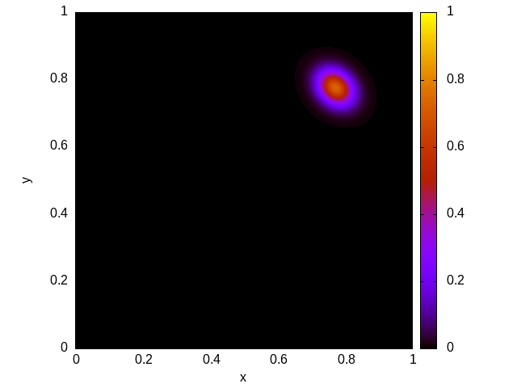
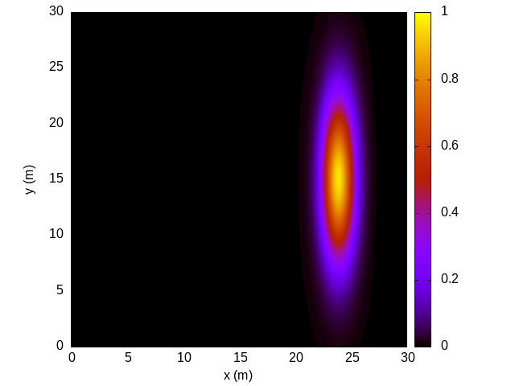
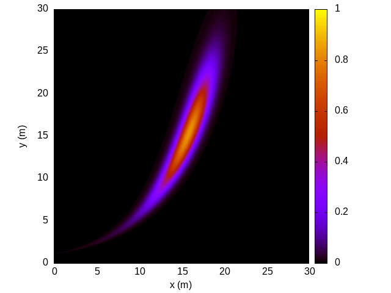
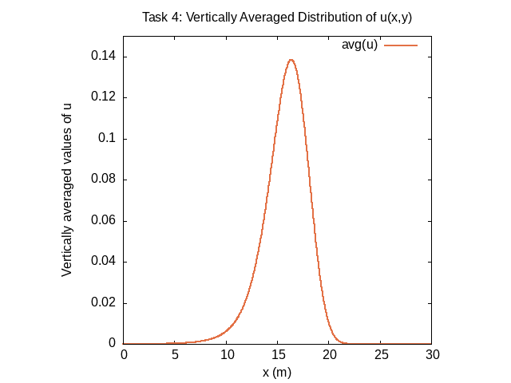

# Guide to execute the code

Link to Github [README.md](https://github.com/dathd6/high-performance-computing-coursework-1.git/README.md)

## File structure 

- [final_task1.png](./final_task1.png) : A plot of the final values of u(x, y) from section 2.1


- [final_task2.png](./final_task2.png) : A plot of the final values of u(x, y) from section 2.2


- [final_task3.png](./final_task3.png) : A plot of the final values of u(x, y) from section 2.3


- [vert_avg.png](./vert_avg.png): A plot showing the vertically averaged profile of u from section 2.4


- [advection2D.c](./advection2D.c): Source code for the final version of the program. The program include the OpenMP directives added in section 2.1 with any changes required to ensure the modified program continues to work correctly. The computational domain, the initial conditions, the velocities and the number of time steps should be set to the values used in section 2.3. When executed, it generates 'final.dat' and 'vert_avg.dat' files

- [plot_final](./plot_final): Gnuplot script to plot graph 'final.png' from 'final.dat' generated by [advection2D.c](./advection2D.c) (Either generated by task 2 or task 3 code)

- [plot_vert_avg](./plot_vert_avg): Gnuplot script to plot line graph from 'vert_avg.dat' 

Additional

- [backup](./backup): Some files you may want to check
    - [advection2D_task1.c](./backup/advection2D_task1.c): C code that run 10 paralleled loop (It has been altered a little in the final version) and generate (final_task1.png)[./final_task1.png] (section 2.1 graph)
    - [plot_final_task1](./backup/plot_final_task1): Gnuplot script to plot graph 'final.png' from 'final.dat' generated by [advection2D_task1.c](./backup/advection2D_task1.c) (section 2.1 graph)
    - [advection2D_task2.c](./backup/advection2D_task2.c): C code that generate 'final.dat' that plot (final_task2.png)[./final_task2.png] (section 2.2 graph)

## Execution

### 1. Install required dependencies: C compiler, OpenMP and GNUplot

```bash
$ sudo apt install gcc libomp-dev gnuplot
```

### 2. Generate task 3 and task 4 graph

```bash
$ gcc -fopenmp -o advection2D -std=c99 advection2D.c -lm
$ ./advection2D
$ gnuplot plot_final # Make sure final.dat in the same folder
$ gnuplot plot_vert_avg # Make sure vert_avg.dat in the same folder
```

### 3. Generate task 2 graph

NOTICE: These step will replace 'final.dat' and 'final.png' files (if they are already generated)

```bash
$ gcc -fopenmp -o advection2D_task2 -std=c99 ./backup/advection2D_task2.c -lm
$ ./advection2D_task2
$ gnuplot plot_final # Make sure final.dat in the same folder
```

### 4. Generate task 1 graph

```bash
$ cd ./backup
$ gcc -fopenmp -o advection2D_task1 -std=c99 advection2D_task1.c -lm
$ ./advection2D_task1
$ gnuplot plot_final # Make sure final.dat in the same folder
```
